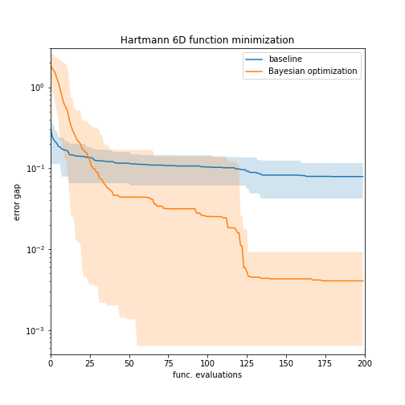

# README

## Results

<figcaption>Fig. 1. Comparison between Bayesian optimization (BayesOpt, orange) and a baseline model (blue). BayesOpt was run using a Gaussian process surrogate model and the expected improvement aquisition function, with 20 initial samples and one new sample aquired at each iteration. The baseline model samples 10^4 random points from a uniform distribution at each iteration. Each model was performed 20 times, and the figure shows the mean (solid line) and the 5-95 percentile region (color-filled area).'</figcaption>

## Content of this repository

- bayes_lib.py: the custom library for bayesian optimization built for this challange. It is built on top of gpytorch and botorch 
- 00_BayesOpt_benchmark.ipynb: the notebook to run the benchmark
- 01_Plot_results.ipynb: a notebook to plot the solution of the benchmark
- hartmann_min.jpg: result figure

## How to run the model

### Method 1: Using google colab
- Open 00_BayesOpt_benchmark.ipynb in google_colab

