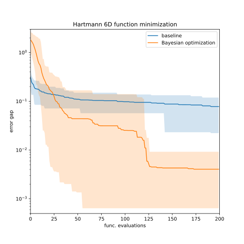

# README

## Benchmark result


<figcaption>Fig. 1. Comparison between Bayesian optimization (BayesOpt, orange) and a baseline model (blue). BayesOpt was run using a Gaussian process surrogate model and the expected improvement aquisition function, with 20 initial samples and one new sample aquired at each iteration. The baseline model samples 10^4 random points from a uniform distribution at each iteration. Each model was performed 20 times, and the figure shows the mean (solid line) and the 5-95 percentile region (color-filled area).'</figcaption>


## Content of this repository

- bayes_lib.py: the custom library for bayesian optimization built for this challange. It is built on top of gpytorch and botorch 
- 00_benchmark.ipynb: the notebook to run the benchmark
- 01_plot.ipynb: a notebook to plot the solution of the benchmark
- hartmann_min.jpg: result figure
- requirements.txt: list of dependency

## How to run the benchmark

### Method 1: Using google colab (easiest)

You can open and run the notebooks on google colab: 
- [benchmark](https://colab.research.google.com/github/abauville/Bayes-opt-challenge/blob/main/00_benchmark.ipynb)
- [plot](https://colab.research.google.com/github/abauville/Bayes-opt-challenge/blob/main/00_plot.ipynb)

You can use either a cpu or gpu runtime environment to run the benchmark. Both are functional, however, since the benchmark problem is rather small it is faster on cpu.

### Method 2: Run locally

Clone this repository:

```
> git clone https://github.com/abauville/Bayes-opt-challenge.git
```

You will find the list of dependencies in requirements.txt. You can install them with
```
> pip install -r requirements.txt
```

You will need JupyterLab or Notebook to run the Jupyter notebooks. These software come installed with the popular [Anaconda package manager](https://www.anaconda.com/).


Run the benchmark using `00_benchmark.ipynb`. This notebook creates result files in the `output/` folder. Use `01_plot.ipynb` to visualize the benchmark results.

## How to run the unit tests

The unit tests can be run locally. First, install the required libraries with `> pip install -r requirements.txt`. Then, in a terminal execute the command `> pytest`, from the root of the repository.
